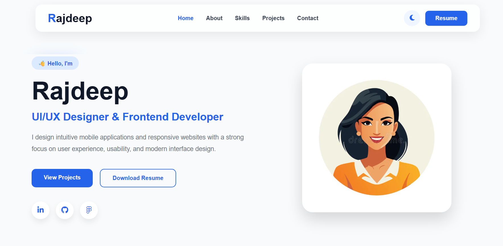
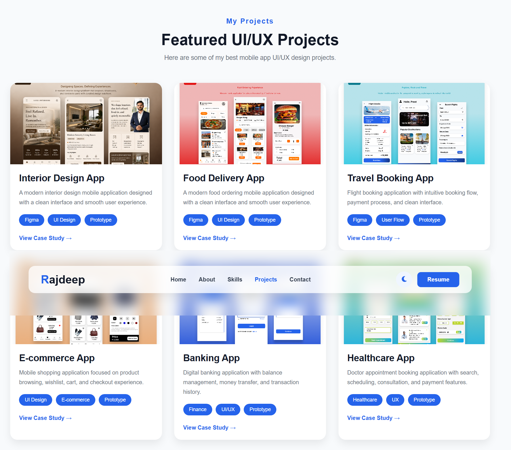

# 🌐 Rajdeep's Portfolio

Welcome to my personal portfolio website! This portfolio showcases my UI/UX design projects, frontend development skills, and case studies.

## 🚀 Live Demo

🔗 Portfolio Website: https://rajdeepk04.github.io/portfolio/

🔗 Interior Design Website: https://rajdeepk04.github.io/interior-design-website/

---

## 👨‍💻 About Me

Hi, I'm **Rajdeep**, a UI/UX Designer and Frontend Developer passionate about creating modern, user-friendly, and responsive digital experiences.

---

## ✨ Features

- Responsive Portfolio Website
- Professional UI/UX Case Studies
- Interactive Project Pages
- Downloadable Resume
- Contact Form
- Figma Prototype Links
- Modern and Clean Design

---

## 🛠️ Technologies Used

### Design
- Figma
- UI Design
- UX Design
- Wireframing
- Prototyping

### Frontend
- HTML5
- CSS3
- JavaScript

### Backend
- Node.js
- Express.js

### Database
- MySQL

---

## 📂 Featured Projects

### 🏠 Interior Design Website
Modern interior design website with a clean and responsive interface.

### 🏥 Healthcare App
Doctor appointment booking mobile application.

### 🛒 E-Commerce App
Fashion shopping mobile application with wishlist, cart, and checkout.

### ✈️ Travel Booking App
Flight booking application with search, payment, and booking confirmation.

### 🍔 Food Delivery App
Restaurant discovery and food ordering application.

### 💳 Banking App
Mobile banking application for secure digital transactions.

---

## 📸 Screenshots

   
      

---

## 📄 Resume

The portfolio includes a downloadable resume for recruiters and employers.

---

## 📫 Contact

**Name:** Rajdeep

**Email:** deepkr0416@gmail.com

**LinkedIn:** www.linkedin.com/in/rajdeep-uiux

**GitHub:** https://github.com/rajdeepk04

---

## ⭐ If you like this project

Please give this repository a ⭐ on GitHub!
